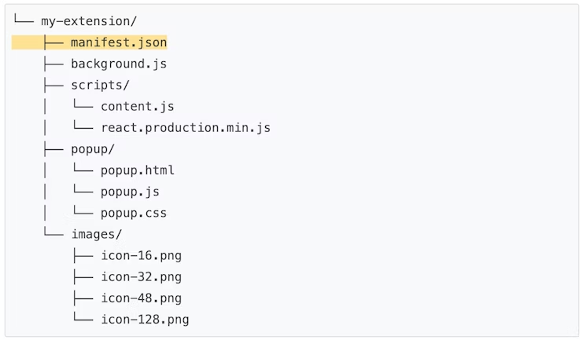

# Chrome Extension 開発メモ

ページを自動翻訳で見つつ自分がわかりやすく日本語訳にしたもの。

大本営
https://developer.chrome.com/docs/extensions/

## はじめに

https://developer.chrome.com/docs/extensions/mv3/

一般的なファイルの種類

1. マニフェストファイル
    - Chrome Extension に必須のファイル。ファイル名は固定で manifest.json。 
    - Chrome Extension のルート ディレクトリに配置する必要がある。 
    - マニフェストファイルは重要なメタデータを記録し、リソースを定義し、アクセス許可を宣言し、バックグラウンドおよびページ上でどのファイルを実行するかを識別します。
1. サービスワーカー
   - 拡張サービス ワーカーはブラウザ イベントを処理し、リッスンします。
   - 新しいページへの移動、ブックマークの削除、タブを閉じるなど、さまざまな種類のイベントがあります。
   - すべてのChrome APIを使用できますが、Web ページのコンテンツと直接対話することはできません。それはコンテンツ スクリプトの仕事です。
1. コンテンツスクリプト
   - コンテンツ スクリプトは、 Web ページのコンテキストで Javascript を実行します。
   - また、注入先のページのDOM を読み取って変更することもできます。
   - コンテンツ スクリプトはChrome APIのサブセットのみを使用できますが、拡張機能サービス ワーカーとメッセージを交換することで残りの API に間接的にアクセスできます。
1. ポップアップとその他のページ
   - 拡張機能には、ポップアップ、オプション ページ、その他の HTML ページなど、さまざまな HTML ファイルを含めることができます。
   - これらすべてのページはChrome APIにアクセスできます。

## 開発の基本

https://developer.chrome.com/docs/extensions/mv3/getstarted/development-basics/

新しいディレクトリを作成して、manifest.json を以下のコードで作成する。

```json
{
  "manifest_version": 3,
  "name": "Hello Extensions",
  "description": "Base Level Extension",
  "version": "1.0",
  "action": {
    "default_popup": "hello.html",
  }
}
```

hello.html

```html
<html>
  <body>
    <h1>Hello Extensions</h1>
  </body>
</html>
```

開発者モードで解凍された拡張機能をロードするには:

1. 新しいタブを開いて アドレスバーに chrome://extensions を入力し「拡張機能」ページに移動します。 
2. 「パッケージ化されていない拡張機能を読み込む」ボタンをクリックし、拡張機能ディレクトリを選択します。


"name": "Hello Extensions of the world!",
に変えてみる

拡張プロジェクトの構築



TypeScript を使う場合に
npm パッケージの chrome-types を使うと便利。
https://www.npmjs.com/package/chrome-types

## サンプルコード（読書の時間）

https://developer.chrome.com/docs/extensions/mv3/getstarted/tut-reading-time/